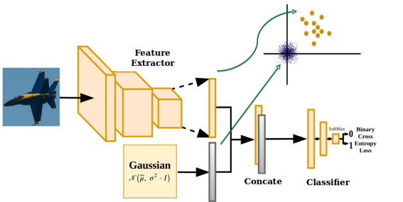
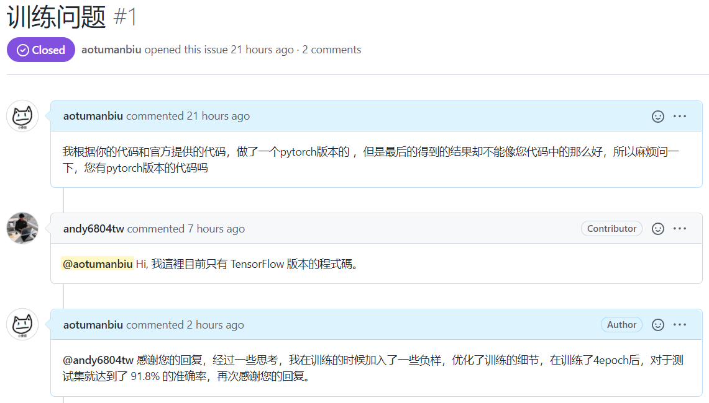
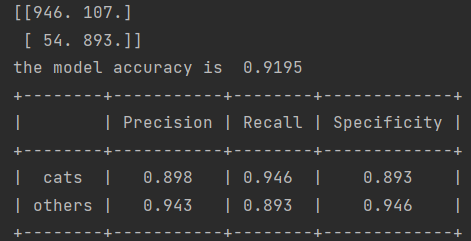
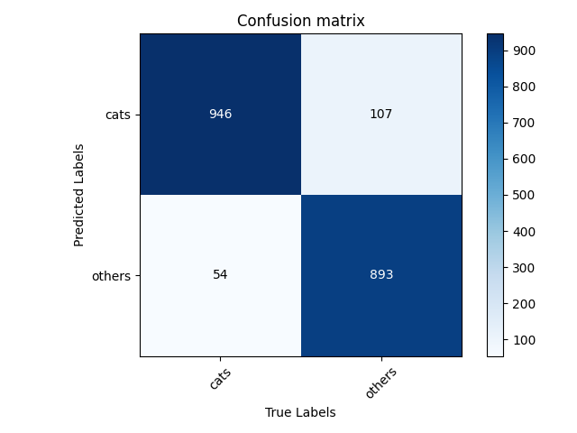

# OC-NN
本代码主要是对 [One-Class Convolutional Neural Network](https://arxiv.org/pdf/1901.08688.pdf) 这篇代码的复现，该论文的思想比较新奇，而且对于测试集检测有着不错的效果。

**====================================================================**

**这里特别感谢 [otkupjnoz ](https://github.com/otkupjnoz/oc-cnn) 论文作者提供的源码 和  [andy6804tw (Yi Lin Tsai )](https://github.com/1010code/OneClass_NeuralNetwork)的帮助**

**====================================================================**


### 1. 网络结构

网络结构可以说十分的简单，Feature Extractor就是一个经典的 VGG or Alexnet or ResNet ！！！

***Feature Extractor：*** 相当于对图片的一个编码，最终会得到一个向量编码。

***Gaussian：*** 利用均值为0，标准差为0.1的高斯噪声，生成同等维度的编码向量，充当负样本编码后的向量。

然后把 ***Feature Extractor*** 和 ***Gaussian*** 的结果进行```Concate```喂给 ***Classifier*** 进行分类。





### 2. 训练细节

##### （1）***Feature Extractor*** 采用了训练模型，进行训练时只训练 ***Classifier***  部分

```python
# ------------------------------------------ #
# 采用预训练模型
# ------------------------------------------ #
backbone = models.vgg16(pretrained=True)

......

# ------------------------------------------ #
# 只训练分类器部分
# ------------------------------------------ #
optimizer = optim.Adam(model.classifier.parameters(), lr=args.lr)
lr_scheduler = optim.lr_scheduler.StepLR(optimizer, step_size=1, gamma=0.94)
```

​		对于该模型的训练，刚开始的时候自己陷入了误区 (就是没有认真看论文) , 我训练了整个网络，也没有使用预训练模型，导致训练了很多 epoch 后测试精度一直不变，看什么图片都是猫。**（X）**

------

针对都是猫的问题，我认为训练时两个编码进行 **concate** 的方式相同会造成网络偷懒（个人感觉）：

---- 采用 **Dropout**：测试精度并没有发生什么变化 **（X）**

---- 拼接后**打乱顺序**：测试精度发生变化 ， 但是还是很差，说明有点作用**（\/）**

```python
@staticmethod
def shuffle(img, labels):
    shuffle = torch.randperm(img.shape[0])
    img = img[shuffle, ...]
    labels = labels[shuffle]
    return img, labels
```

-------


##### (2) 训练时加入一些真实的负样本

在训练方式都设置好之后，发现测试效果还是很差，各种尝试后还是不行，所以有点烦躁。

后来经过思考和查阅资料，于是就在训练集中加入了少许的负样本，最后达到了不错的测试准确率。

**附图：**




### 3. 测试结果

**混淆矩阵：**





**可视化：**





### 权重

***address: https://pan.baidu.com/s/13aJrV7JUGGT02LnEbxt1IQ pw: izpx***

